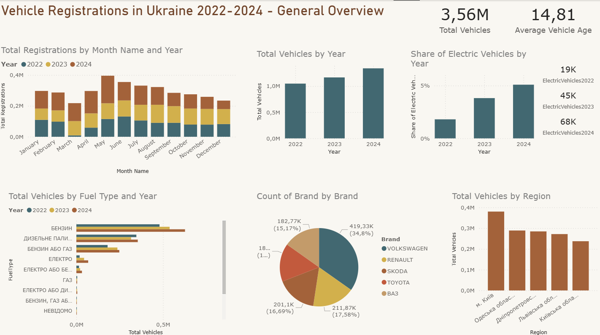

# Ukraine Vehicle Registration Analysis (2022–2024)

A Power BI analytical project exploring vehicle registrations in Ukraine between 2022 and 2024.
This report provides insights into registration activity, fuel type distribution, regional trends, brand popularity, fleet electrification, and average vehicle age.

***
## 🔍 Project Overview

This project analyzes over 3.5 million vehicle records from Ukrainian open datasets.
The analysis focuses on identifying trends in:

- Total vehicle registrations
- Regional and monthly activity
- Fuel type structure (including EV adoption)
- Most popular brands
- Average vehicle age
- Year-over-year changes
  
This helps policymakers, analysts, and transportation specialists understand how the Ukrainian vehicle fleet evolved during 2022–2024.

***
## 📊 Power BI Report
🔗 [Download PBIX ](https://drive.google.com/drive/folders/1WlcnQbTGTHujMpzeIFAdEV71zJAVRB7u?usp=sharing)

📄 [A PDF export of the Power BI dashboard is included in this repository.](./UA Transport Insights.pdf)
***
## 🛠️ Tools & Technologies

Power BI Desktop – data modeling, DAX, visualizations

Power Query – data preparation & transformation

DAX – metrics: YoY%, averages, EV share, etc.

Git & GitHub – version control

Open Data Portal of Ukraine – data source
***
## 📂 Data Description

Dataset includes:

- Registration date
- Fuel type
- Brand & model
- Engine & weight characteristics
- Vehicle body type
- Registration region
- Owner type

Three yearly datasets were merged into one analytical model.
Data was collected for **2022, 2023, and 2024**, transformed, cleaned, and merged into a unified format.
***
## 🧹 Data Preparation (Power Query)

Key steps:

- Removed duplicates
- Cleaned and standardized fuel type names
- Fixed region identifiers using reference tables
- Converted text dates into proper date format
- Processed KOATUU codes
- Appended 2022–2024 datasets

Created dimension tables:

 - `DimFue`

 - `DimBrand`

 - `DimRegion`

 - `DateTable`
***
## 🧩 Data Model

The model uses a star schema.

### 🟦 Fact Table

`vehicles_all` — appended data for 2022, 2023, 2024

### 🟨 Dimension Tables

- `DateTable`
- `DimFuel`
- `DimBrand`
- `DimRegion`

Relationships:
**One-to-many** from each dimension table → fact table.
***
## 🧮 Key DAX Measures

Examples of metrics:

      Total Vehicles = COUNTROWS(vehicles_all)
      
      Electric Vehicles = CALCULATE([Total Vehicles], DimFuel[FuelType] = "ЕЛЕКТРО")

      EV Share % = DIVIDE([Electric Vehicles], [Total Vehicles])

      Average Vehicle Age = AVERAGEX(vehicles_all, YEAR(TODAY()) - vehicles_all[MakeYear])

      Vehicles YoY % = DIVIDE([Total Vehicles] - [Total Vehicles PY], [Total Vehicles PY])
***
## 📈 Main Insights
### 🚗 Total registrations grew each year (2022 → 2024)

2024 had the strongest increase (+14.9% YoY).

### ⚡ Electric vehicle adoption increased

EV share grew from ~2% (2022) to ~5% (2024).

### 🛢️ Fuel distribution is dominated by gasoline and diesel

Gasoline remains the largest category across all years.

### 🌍 Kyiv and western regions lead in registrations

Kyiv City has the highest activity.

### 🚙 Most popular brands

Volkswagen, Renault, Škoda, Toyota, BMW.

### 🕒 Average vehicle age

Around 15 years, slightly decreasing over time.
***
## 🗂️ Report Pages
**1. General Overview**
- Total vehicles
- YoY change
- Fuel structure
- EV share
- Brand distribution
- Regional breakdown

**2. Year 2022**
- Detailed annual view.

**3. Year 2023**
- Detailed annual view.

**4. Year 2024**
- Detailed annual view.
***
## 🚀 How to Use

Download the PBIX file

Open it in Power BI Desktop

Use slicers to explore data by:

- Year
- Region
- Fuel type
- Brand
- Month
***
## 📌 Future Improvements

- Add 2025 forecast
- Include more datasets
- Integrate geographic heatmap visualizations
- Expand EV analysis by region and brand
***
### 🙌 Acknowledgements

Data sourced from the Open Data Portal of Ukraine.
Designed, cleaned, modeled, and visualized using Power BI.
